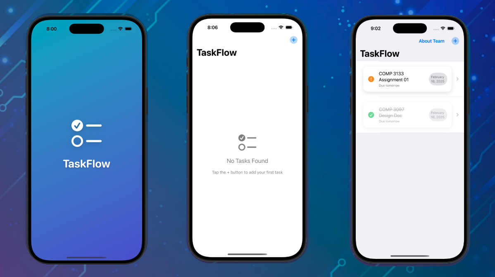
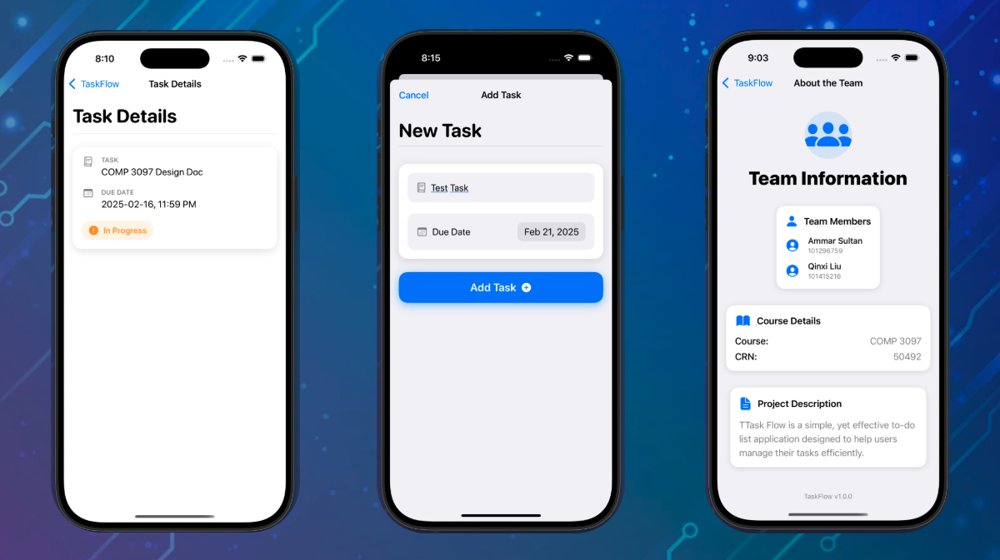

# TaskFlow

TaskFlow is a task management application built with SwiftUI, designed to help users organize and manage their tasks efficiently.
This README provides an overview of the app's key features along with screenshots of different screens.

## Screenshots

### Splash Screen, Home Page (No Tasks), and Home Page with Tasks

This image contains the splash screen, the empty home page, and the home page displaying tasks:



### Task Detail Page, Add a New Task Page, and About Us Page

This image contains the Task Detail Page, Add Task Page, and About Us Page:



## Installation

To run TaskFlow on your device:

1. Clone this repository:

   ```bash
   git clone https://github.com/yourusername/TaskFlow.git
   ```

2. Open the project in Xcode.

3. Build and run the project on a simulator or physical device.

## Technologies Used

- **SwiftUI** for UI development
- **Core Data** for task storage
- **Swift Package Manager** for dependencies
